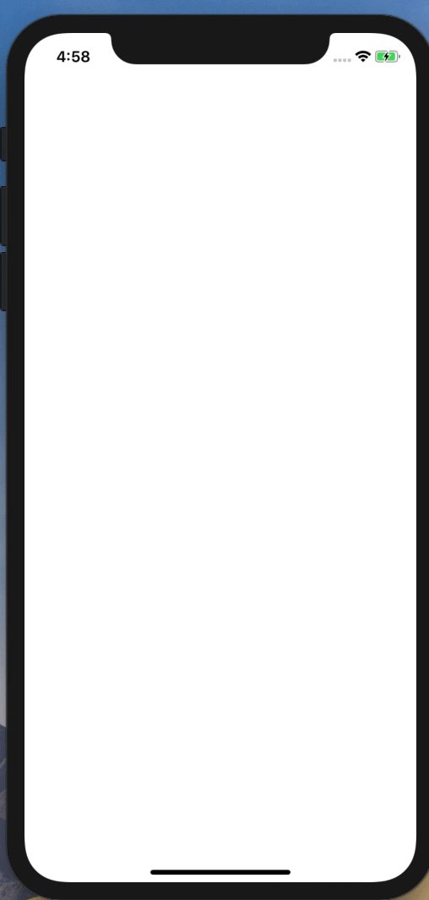
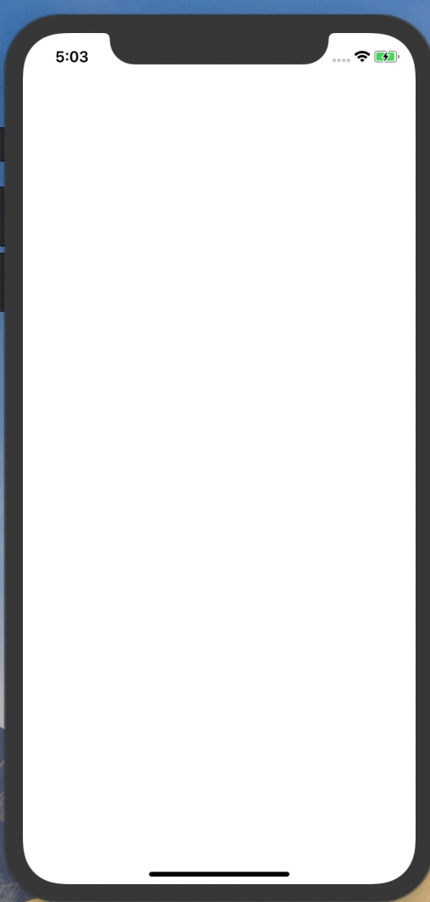
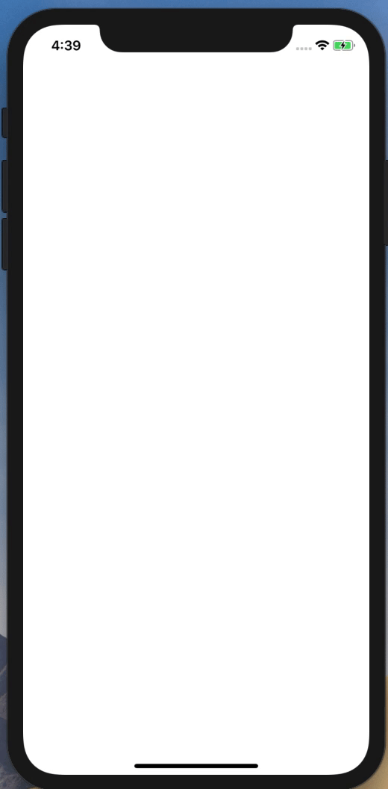

# SwiftlyIndicator
  [](https://cocoapods.org/pods/SwiftlyIndicator) [](https://github.com/Carthage/Carthage)

---

## Installation

```ruby
pod 'SwiftlyIndicator'
```

## Example
```Swift
// Image Indicator
view.startImageSwitflyIndicator(images: [UIImage], milliseconds: Int)
```


```Swift
// Image Rotation Indicator
view.rotationImageSiwftlyIndicator(images: [UIImage], bgColor: UIColor)
```


```Swift
// default
view.startSwiftlyIndicator()
```


```Swift
// Rotation
view.rotationSwiftlyIndicator()
```

